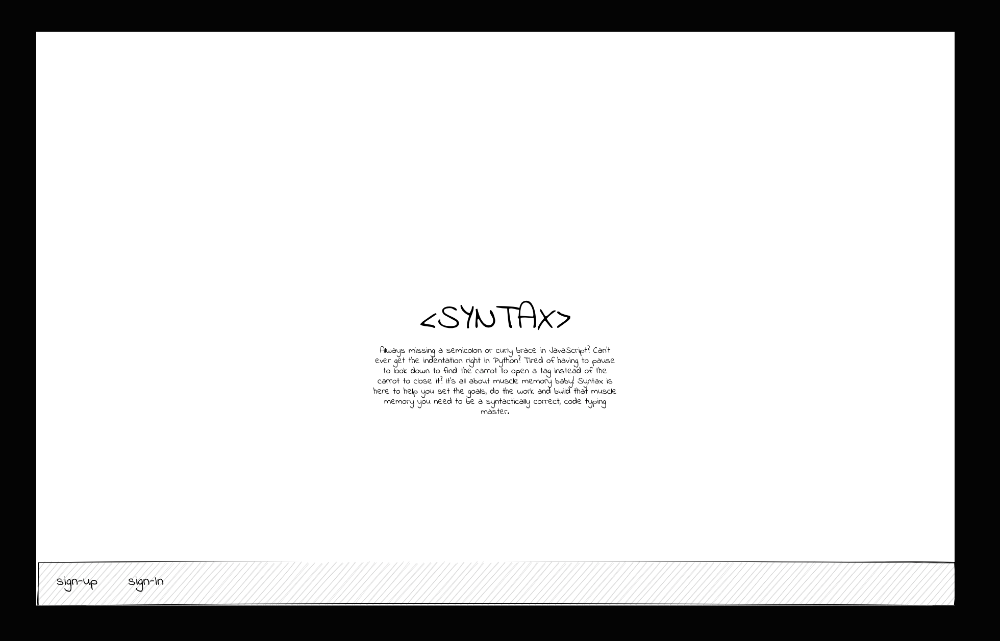
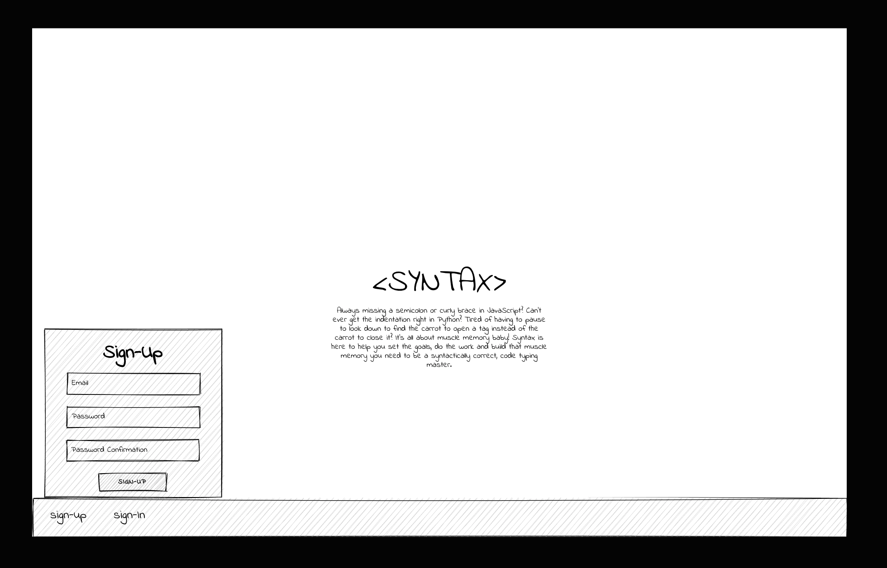
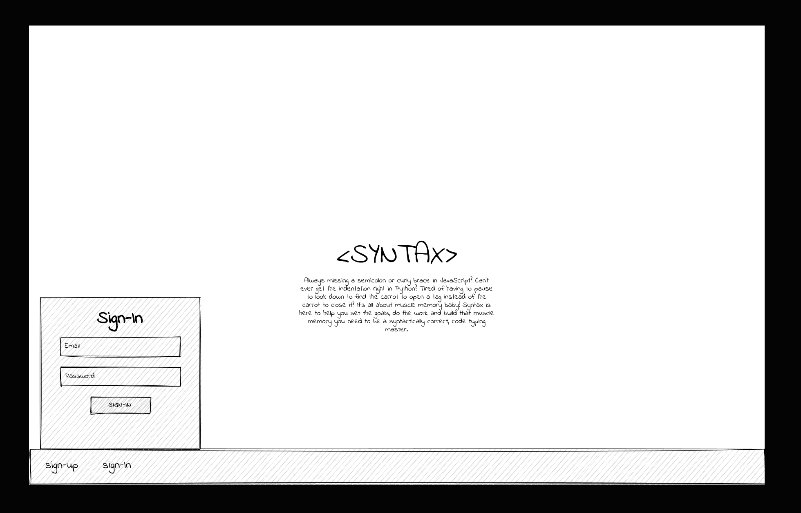
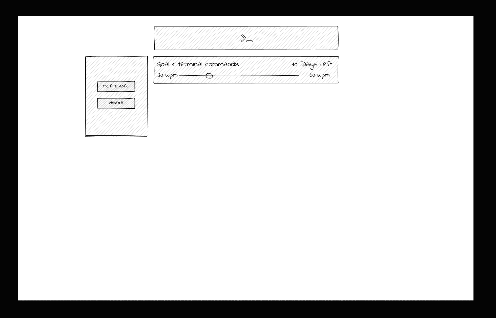
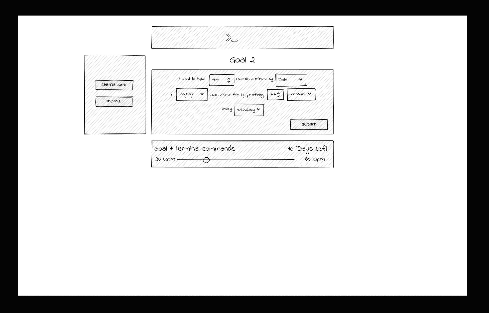
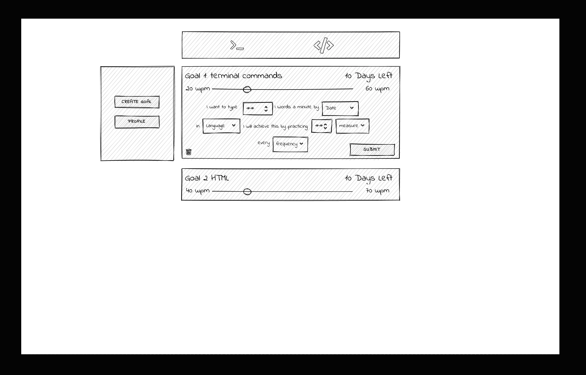
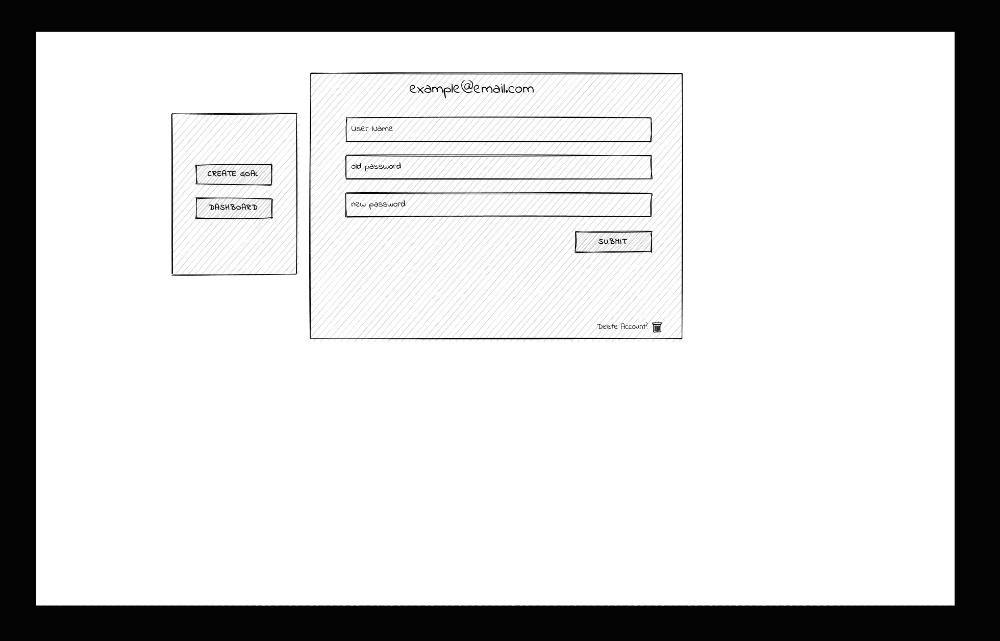
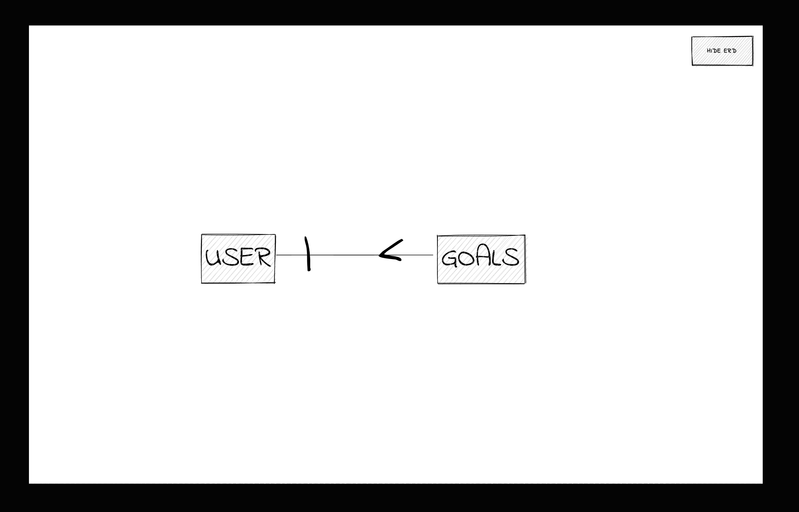

# < Syntax />

## About

< Syntax /> is a web app designed to hone the typing speed and syntactical skills of any developer. Developers of all levels can benefit from practicing the fundamentals. 

Don't believe me? Give it a try HERE. Simply sign up (using a fake email is recommended), create a goal, then start practicing to see how fast you can level up and achieve your goals.

#

If you are interested in seeing how I created this app you can check out the code for my front end client [HERE](https://github.com/CaldoNic7/Syntax-Client/tree/dev) or my back end API [HERE](https://syntax-typing-practice.herokuapp.com/) and it's corresponding git hub repo [HERE](https://github.com/CaldoNic7/Syntax-back-end). Please leave a comment and let me know what you think!

#
## Technologies

Technologies I used to build this SPA include...

 + JavaScript

 + React

 + HTML/CSS

 + Bootstrap

 + Python

 + Django

 + PostSQL

### Dependencies

[momentjs](https://momentjs.com/)
```
npm install moment --save
```

#

## User Stories
### Version 1
#### As a user I would like to be able to ...

1. sign up with my email and a password
2. sign in with my email and password
3. change my password once i'm signed in
    and sign out if i am signed in
#### I would also like to...
4. create goals
5. view a snapshot of my progress on my goals
6. view my goals details
7. update my goals
8. delete my goals
#### In my goals i would like to...
1. set the language I want to focus on practicing
2. set a deadline for a specific goals completion
3. set how often I want to practice (ie 30min every day)
    and receive reminders to sign in and practice.

#### As a developer I want to provide users with...

1. a well thought out app that is intuitive and seamless in design
2. an aesthetically pleasing design
3. The ability to CRUD on 'SMART' goals quickly and easily.

#
## Outstanding Tasks
Here are some of the things I plan to tackle as I continue to work on developing this app...
  * Styling
  * Game Play
  * adding a username
  * profile with picture
  * Leader Board
  * Social interaction via comments and a chat function
  * User vs User Challenges
  * Trivia
  * Practice Problems
  
## Wire Frames
### Home when a user is not signed in



### Sign-Up



### Sign-In



### Home or Dashboard for a signed-in user



### Create an additional goal



### Update or Delete a goal



### Profile Settings (including change password)



#

Entity Relationship Diagrams (ERD) and API Routes
### ERD

### API Routes

User Routes
| NAME         | URL       | Verb | AUTHENTICATED |          Description             |
|:------------:|:---------:|:----:|:-------------:|:--------------------------------:|
|signUp        |/sign-up/  |POST  |      NO       | creates new user                 |
|signIn        |/sign-in/  |POST  |      NO       | signs user in and creates token  |
|signOut       |/sing-out/ |DELETE|      YES      | signs user out and deletes token |
|changePassword|/change-pw/|PATCH |      YES      | changes user password            | 

Goal Routes
| NAME          | URL            | Verb  |          Description             |
|:-------------:|:--------------:|:-----:|:--------------------------------:|
|createGoal     |/goals/         |POST   | creates new goal                 |
|indexUserGoals |/goals/         |GET    | shows all of that users goals    |
|showGoal       |/goals/:goalId/ |GET    | shows a specific goal            |
|updateGoal     |/goals/:goalId/ |PATCH  | updates a goal                   | 
|deleteGoal     |/goals/:goalId/ |DELETE | deletes a goal                   | 

#

## Styling

### Colors:

background1:  (Darkest)
```
#2B4450
rgba(43, 68, 80, 1)
```
background2: (dark)
```
#497285
rgba(73, 114, 133, 1)

```
background3: (white)
```
#FFFFFF
rgba(255, 255, 255, 1)
```
accent1: (light)
```
#DFEBED
rgba(223, 235, 237, 1)
```
accent2: (orange)
```
#F78536
rgba(247, 133, 54, 1)
